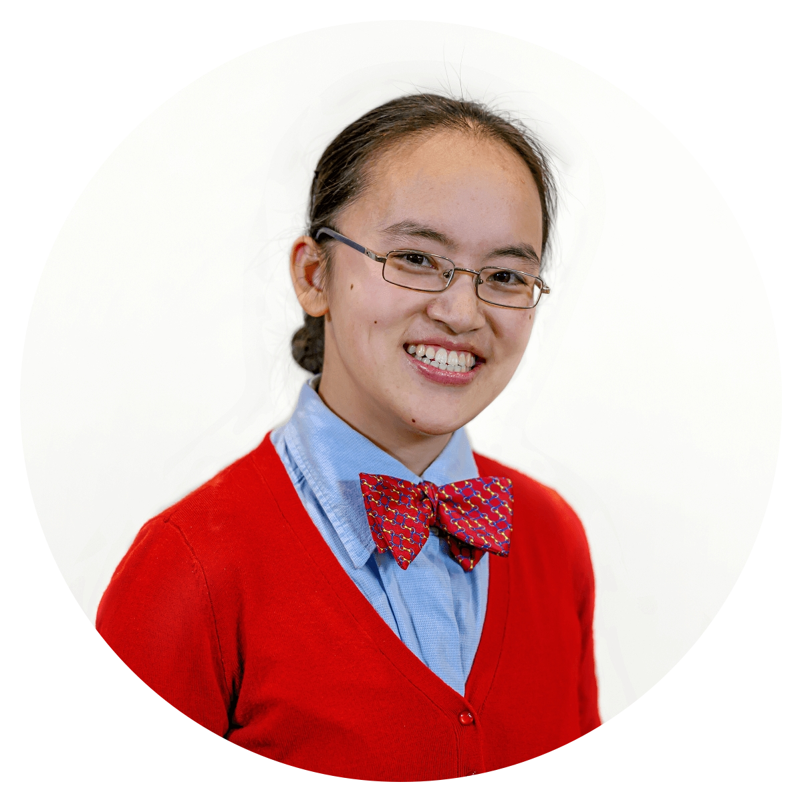

---
date: "2023-10-24"
design:
  spacing: 6rem
sections:

- block: hero
  id: hero
  content:
    text: |
     
MSc. Student (Biology) at Mount Allison University

    title: <h1 class="font-bold tracking-tight" style="font-size:4rem; color:black">Christelinda Laureijs</h1>
  design:
    background:
      image:
        filename: Lab-Rats-Hero-white-top.png
        parallax: false
    spacing:
      margin:
      - 0
      - 0
      - 0
      - 0
      padding:
      - 0
      - 0
      - 0
      - 0
      
      
- block: markdown
  id: intro
  content:
    title: <h2 class="font-bold tracking-tight" style="font-size:2.7rem; color:black; line-height:125%">I am a researcher, coder, and artist</h2>
    text: | 
      I am a master's student working under the supervision of Dr. Karen Crosby at Mount Allison University. My work focuses on the effect of insulin on neurons in the dorsomedial hypothalamus (DMH), which is a brain region critical for appetite regulation.
      
      I aim to answer these questions:
      
      1. How does bodyweight and food intake change after insulin is injected into the DMH?
      2. Does insulin signalling in the DMH affect physiological processes other than appetite regulation, such as energy metabolism or thermoregulation?
      3. What signal transduction pathways are activated by insulin binding in the DMH?
      4. Does insulin signalling in the DMH change in rats who consume high-fat or high-sugar diets?
      5. How does diabetes affect insulin signalling in the DMH?
      
      For my research, I use techniques such as whole-cell patch clamp electrophysiology, stereotaxic surgeries, and behavioural monitoring. 
      
      
  design:
    background:
      image:
        filename: Green-neuron2.svg
        parallax: false
        position: right
        
        
- block: markdown
  id: projects
  content:
      title: Things I've been working on
  design:
    background:
      color: white
      text_color_light: false
    spacing:
      padding: ["25px", "0", "10px", "0"]
  
- block: markdown
  id: honours
  content:
      text: |
        <h3>Honours work: Does insulin act in the DMH?</h3>
        For my honours project, I asked if insulin binds to DMH neurons, and if so, how that may affect their activity. I compared synaptic transmission (a measure of communication between neurons) and action potentials (a measure of neuronal excitability) before and after exposing DMH neurons to insulin.
        
        I found that insulin <b>decreases</b> both excitatory synaptic transmission and neuronal excitability in DMH neurons. If you're interested in reading more, you can explore <a href="https://github.com/christelinda-laureijs/honours-thesis" target="_blank" title="Explore the GitHub project!">the project page on GitHub</a> and <a href="https://github.com/christelinda-laureijs/honours-thesis/blob/main/Thesis/Thesis.pdf" target="_blank" title="Read my thesis as a PDF file">read my thesis!</a>
  design:
    background:
      image:
        filename: insulin.svg
        parallax: false
        position: left

- block: markdown
  id: coding
  content:
      text: |
        <h3>Coding Projects</h3>
        
        
I always have some sort of coding project on the go. I code most frequently in R & RMarkdown, but I also like to build things with LaTeX and HTML. My most recent projects have included creating a reproducible RMarkdown/LaTeX thesis template, coding a website (this one!) and developing R scripts to analyze the recordings that we collect in the lab.

  design:
    background:
      image:
        filename: Rat-Laptop.svg
        size: cover
        parallax: false

- block: markdown
  id: art
  content:
      text: |
        <h3>Scientific illustrations</h3>
        
        Art, graphic design, and typography are key interests of mine. I particularly enjoy using art to improve understanding of scientific concepts. Most of my diagrams are featured in my presentations, but I also create stand-alone scientific illustrations and figures. My main illustration tools are [Inkscape](https://inkscape.org/) (a free, open-source vector illustrator), *ggplot2*, and watercolour. I'm also familiar with using tools like [Mol*](https://molstar.org/viewer/) to generate and modify 3D protein structures.  
        
- block: markdown
  id: artpicture
  content:
    text: |
        
  design:
    background:
      image:
        filename: Scientific-art-banner.svg
        parallax: false
        position: center

- block: markdown
  id: crankybeeart
  content:
      text: |
        <h3>Cranky Bee Art</h3>
        
        A few years ago, I started an online business featuring my watercolour art and nature photography. It grew quickly and little did I know that this fun project would soon become a big part of my artistic life. I have lots of fun imagining animals like mice, bears and giraffes doing human activities and celebrating special occasions together. 
        
        <a href="https://crankybeeart.com/" target="_blank" title="Click here to visit the Cranky Bee Art website!">Cranky Bee Art</a> specializes in greeting cards for adoption day anniversaries, birthdays, and holidays, as well as creating small moments that make every day special. I'm particularly proud of my "Just Because" series to send to people - well, just because you want to check in and let them know that you're thinking of them.
        
        

        <button type="button" style="background-color:#f5f5f5; color:white; padding: 15px 32px; cursor:pointer; border-radius: 15px"><a href="https://crankybeeart.com/" target="_blank" title="Click here to visit the Cranky Bee Art website!">Visit Cranky Bee Art!</a></button>
        

- block: markdown
  id: beeartpicture
  content:
    text: 
  design:
    background:
      image:
        filename: watercolour-banner.svg
        parallax: false
        position: center     

- block: markdown
  id: contact
  content:
      title: Contact
      text: |
        Let's connect! If you have ideas for collaboration, knowledge of useful R scripts or packages, or ideas for what card I should paint next, I would love to hear from you.
        
        
        
        <form name="contact" method="POST" data-netlify="true">
          

            <label>Your Name<input type="text" name="name" /></label>
          

          

            <label>Your Email <input type="email" name="email" /></label>
          

          

            <label>Message: <textarea name="message"></textarea></label>
          

          

            <button type="submit">Send</button>
          

        </form>
        

- block: markdown
  id: cv
  content:
      title: CV
      text: |
          Don't go yet! If you want to read more about me, here's <a href="Laureijs-CV.pdf" target="_blank" title="Click here to open a my CV as a PDF file">my CV.</a>

title: Home
type: landing
---