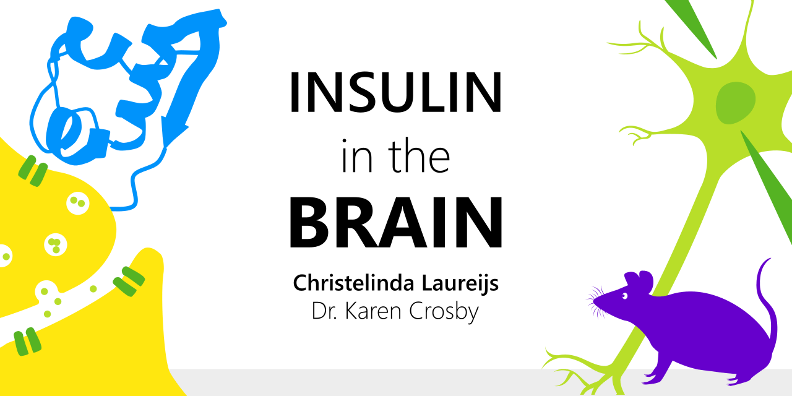

---
date: "2023-10-24"
design:
  spacing: 6rem
sections:
- block: hero
  content:
    text: "Neurophysiology | Appetite Regulation | Endocrinology"
    title: Christelinda Laureijs
  design:
    background:
      image:
        filename: Lab-Rats-Hero.png
        filters:
          brightness: 0.5
        text_color_light: true
        size: cover
        parallax: false
    css_class: dark
    spacing:
      margin:
      - 0
      - 0
      - 0
      - 0
      padding:
      - 20
      - 0
      - 20
      - 0
- block: markdown
  content:
    title: I am a researcher, R coder, and artist
    text: I am a master's student working under the supervision of Dr. Karen Crosby at Mount Allison University. My work focuses on the effect of insulin on neurons in the dorsomedial hypothalamus (DMH), which is a brain region critical for appetite regulation.
  design:
    background:
      image:
        filename: Green-neuron.svg
        parallax: true
- block: markdown
  content:
      title: Projects
  design:
    background:
      color: white
      text_color_light: false
    spacing:
      padding: ["25px", "0", "10px", "0"]
  id: projects
- block: markdown
  content:
      text: |
        <h3>Does insulin act in the DMH?</h3>
        For my honours project, I asked if insulin binds to DMH neurons, and if so, how that may affect their activity. I compared synaptic transmission (a measure of communication between neurons) and action potentials (a measure of neuronal excitability) before and after exposing DMH neurons to insulin.
         
        I found that insulin decreases both excitatory synaptic transmission and neuronal excitability in DMH neurons.
        
  #id: projects

title: Home
type: landing
---